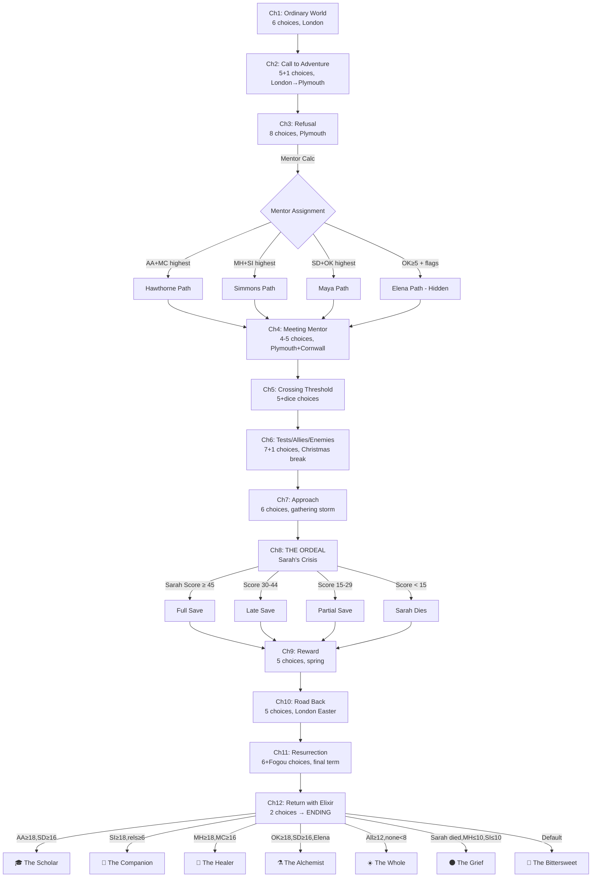

# The CK: Amelia V2 — Choice Map

> Every player-facing decision in the game, mapped with exact point values, conditional triggers, relationship effects, and branching consequences. This is the mechanical skeleton — the numbers that run silently under the narrative.

---

## READING THIS DOCUMENT

### Notation
- **`[AA +1]`** — stat gain
- **`[MC -2]`** — stat loss (negative point)
- **`{Ella +1}`** — relationship gain
- **`{Sarah -1}`** — relationship loss
- **`(IF condition)`** — conditional: scene or option only appears when condition is met
- **`>>GATE`** — this choice gates future content (locks/unlocks scenes later)
- **`★ ELENA KEY`** — one of the three Elena-unlock requirements
- **`⚠ NEGATIVE`** — choice that reduces a stat
- **`🎲 KARMA DICE`** — hidden d20 roll at this moment

### Per-Choice Budget
Most choices award **1–2 points** to one or two stats. Multi-stat awards (+1, +1) are for choices that genuinely serve both dimensions. The player can only pick ONE option per choice.

---

## CHAPTER 1: THE ORDINARY WORLD

**Location:** London | **Month:** Late September | **Choices:** 6 | **Max earnable:** ~8 pts

### Choice 1.1 — The Park Bench (What is Amelia reading?)
| Option | Stats | Relationships | Notes |
|--------|-------|---------------|-------|
| A) *Thinking, Fast and Slow* (Kahneman) | `[AA +1]` | — | Establishes academic focus |
| B) *Man and His Symbols* (Jung) | `[SD +1]` | — | Foreshadows Lucas/Jung thread |
| C) *The Tibetan Book of Living and Dying* | `[OK +1]` | — | First step on the occult path |

### Choice 1.2 — Ella's Call (Responding to her unspoken worry)
| Option | Stats | Relationships | Notes |
|--------|-------|---------------|-------|
| A) "We'll FaceTime every day, I promise." | `[SI +1]` | `{Ella +1}` | Comforting but unrealistic |
| B) "It's going to be weird, isn't it?" | `[MH +1]` | `{Ella +1}` | Honest — stronger long-term foundation |

### Choice 1.3 — Dinner with the Family (What Amelia expects from uni)
| Option | Stats | Relationships | Notes |
|--------|-------|---------------|-------|
| A) "First in our family with a degree." | `[AA +1] [MC +1]` | — | Sets up David's conditional line in Ch2 |
| B) "Just want to figure out who I am." | `[SD +1] [MH +1]` | — | Introspective, honest |
| C) "Psychology, philosophy, older traditions..." | `[OK +1] [SD +1]` | — | Hints at esoteric interests |

### Choice 1.4 — Packing (One last item)
| Option | Stats | Relationships | Notes |
|--------|-------|---------------|-------|
| A) Psychology flashcards | `[AA +1]` | — | Studious |
| B) Photo of her and Ella | `[SI +1]` | `{Ella +1}` | Sentimental |
| C) A blank journal | `[SD +1]` | — | Open to the unknown |

### Choice 1.5 — The Bookshop (Which book?)
| Option | Stats | Relationships | Notes |
|--------|-------|---------------|-------|
| A) Modern psychology anthology | `[AA +1]` | — | Safe, practical |
| B) *Letters to a Young Poet* (Rilke) | `[MH +1]` | — | "You must change your life" |
| C) *Aurora of the Philosophers* (Paracelsus) | `[OK +1]` | — | **★ ELENA KEY 1 of 3** `>>GATE` |

### Choice 1.6 — The Thames at Night (What she thinks about)
| Option | Stats | Relationships | Notes |
|--------|-------|---------------|-------|
| A) "I'm going to make everyone proud." | `[AA +1] [MC +1]` | — | Duty-driven |
| B) "I'm terrified and I don't know if I can do this." | `[MH +1]` | — | Vulnerability as courage |
| C) She doesn't think. Watches the water. | `[SD +1]` | — | Contemplative, present |

### Scene 1.7 — The Night Before
No choice. Ella texts: "you're going to be amazing. don't forget me x." Narrative beat.

### Chapter 1 Totals
| Stat | Max Available | Via |
|------|---------------|-----|
| AA | 4 | 1.1A, 1.3A, 1.4A, 1.5A, 1.6A |
| SI | 2 | 1.2A, 1.4B |
| MH | 3 | 1.2B, 1.5B, 1.6B |
| SD | 5 | 1.1B, 1.3B, 1.3C, 1.4C, 1.6C |
| MC | 2 | 1.3A, 1.6A |
| OK | 3 | 1.1C, 1.3C, 1.5C |
| **Total pool** | **19** | Player earns ~8 from 6 choices |

---

## CHAPTER 2: THE CALL TO ADVENTURE

**Location:** London → Plymouth | **Month:** Early October | **Choices:** 5 (+1 conditional) | **Max earnable:** ~8–10 pts

### Choice 2.1 — Goodbye to Lily
| Option | Stats | Relationships | Notes |
|--------|-------|---------------|-------|
| A) "Look after mum and dad for me." | `[SI +1]` | `{Lily +1}` | Protective/trusting |
| B) "You can call me anytime. I mean it." | `[MC +1]` | `{Lily +1}` | Mentoring instinct |

### Scene 2.2 — The Drive (No choice)
Conditional flavour: `(IF Ch1.3 == A)` → David says "We're proud of you whatever happens."

### Choice 2.3 — Meeting Liz (Response to her energy)
| Option | Stats | Relationships | Notes |
|--------|-------|---------------|-------|
| A) "Tell me everything about the dog!" | `[SI +1]` | `{Liz +1}` | Warm, open |
| B) "It's nice to meet you too." | `[MH +1]` | — | Self-protecting; Liz still friendly but less close |

### Choice 2.4 — The Kitchen (Who to approach first)
| Option | Stats | Relationships | Notes |
|--------|-------|---------------|-------|
| A) Raj — the food smells amazing | `[SI +1]` | `{Raj +1}` | Immediate warmth |
| B) Lucas — curious about his book | `[SD +1]` | `{Lucas +1}` | Intellectual spark |
| C) Sarah — something pulls her over | `[MH +1]` | `{Sarah +1}` | Empathic instinct; critical for Sarah thread |

### Choice 2.5 — The SU Night Out (How to navigate)
| Option | Stats | Relationships | Notes |
|--------|-------|---------------|-------|
| A) Throws herself in, stays till close | `[SI +1]` | — | Social courage |
| B) Quiet corner, people-watches | `[SD +1]` | — | Observer mode |
| C) Leaves early, calls Ella | `[MH +1]` | `{Ella +1}` | Safety; but misses SI opportunity |

### Choice 2.6 — Psychology Welcome Lecture (Reaction to Hawthorne)
| Option | Stats | Relationships | Notes |
|--------|-------|---------------|-------|
| A) *Want to impress him.* | `[AA +1]` | — | Achievement-driven |
| B) *That's exactly why I'm here.* | `[SD +1]` | — | Purposeful |
| C) *Brilliant or terrifying.* | `[OK +1]` | — | Sensing the depth |

### Conditional Scene 2.C — The Flat Party
**Trigger:** `(IF SI ≥ 3 OR {Liz} ≥ 1)`
Maya reads tarot. "The Tower. Don't worry — it's actually a good card. Eventually."
- Auto-awards: `[OK +1]` `{Maya +1}`
- No player choice — this is a reward scene for social engagement.

### Chapter 2 Totals
| Stat | Max Available | Via |
|------|---------------|-----|
| AA | 1 | 2.6A |
| SI | 3 | 2.1A, 2.3A, 2.4A, 2.5A |
| MH | 3 | 2.3B, 2.4C, 2.5C |
| SD | 3 | 2.4B, 2.5B, 2.6B |
| MC | 1 | 2.1B |
| OK | 2+1 | 2.6C, +conditional scene |
| **Total pool** | **13–14** | Player earns ~8–10 |

---

## CHAPTER 3: REFUSAL OF THE CALL

**Location:** Plymouth campus | **Month:** Oct–Nov | **Choices:** 8 (+1 negative) | **Max earnable:** ~10–12 pts

### Choice 3.1 — Liz's Homesickness (2am in the kitchen)
| Option | Stats | Relationships | Notes |
|--------|-------|---------------|-------|
| A) Sit with her, make tea, listen | `[SI +1] [MH +1]` | `{Liz +1}` | Compassionate |
| B) Check on her briefly, then go back to bed | `[MH +1]` | — | Self-care, but missed connection |
| C) Pretend not to hear, go back to bed | — | `{Liz -1}` | Avoidance |

### Choice 3.2 — Tasha's First Attack (Cutting remark)
| Option | Stats | Relationships | Notes |
|--------|-------|---------------|-------|
| A) Stand up to her calmly | `[MC +1]` | `{Tasha +1}` | Brave; Tasha respects it even if she doesn't show it |
| B) Walk away, don't engage | `[MH +1]` | — | Self-protection; Tasha sees weakness |
| C) Laugh along to fit in | — | `{Tasha +1}` | **⚠ NEGATIVE** `[MC -1] [SI -1]` Complicity |

### Choice 3.3 — Zara's Confrontation (Tasha's racism in seminar)
| Option | Stats | Relationships | Notes |
|--------|-------|---------------|-------|
| A) Support Zara publicly | `[MC +1] [SI +1]` | `{Zara +1}` `{Tasha -1}` | Courageous; makes an enemy |
| B) Stay quiet, talk to Zara after | `[SI +1]` | `{Zara +1}` | Supportive but not publicly brave |
| C) Stay out of it entirely | — | — | Neutral; Zara notes the silence |

### Choice 3.4 — Lucas's Jung Reading Group
| Option | Stats | Relationships | Notes |
|--------|-------|---------------|-------|
| A) Attend, engage deeply | `[SD +1]` | `{Lucas +1}` | Intellectual bond deepens |
| B) Attend but distracted by workload | `[AA +1]` | — | Studying instead of being present |
| C) Skip it — too overwhelmed | — | — | Missed opportunity |

### Choice 3.5 — Maya's Ceremony (Candlelit meditation/ritual)
| Option | Stats | Relationships | Notes |
|--------|-------|---------------|-------|
| A) Attend and participate fully | `[OK +1]` | `{Maya +1}` | **★ ELENA KEY 2 of 3** `>>GATE` |
| B) Attend but observe from the edge | `[SD +1]` | `{Maya +1}` | Respectful distance |
| C) Decline — it's not her thing | — | — | Door doesn't close but narrows |

### Choice 3.6 — The Panic Attack (Library, midterms)
| Option | Stats | Relationships | Notes |
|--------|-------|---------------|-------|
| A) Go to student counselling | `[MH +2]` | — | Brave, healthy, +2 because seeking help is hard |
| B) Push through, finish the essay | `[AA +1]` | — | Productive but unaddressed |
| C) Call Ella in tears | `[SI +1]` | `{Ella +1}` | Connection; Ella talks her down |

### Choice 3.7 — Sarah on the Hoe Bench ("Do you ever feel like you're watching your life from outside?")
| Option | Stats | Relationships | Notes |
|--------|-------|---------------|-------|
| A) "Yeah... I think I do sometimes." (honest vulnerability) | `[MH +1]` | `{Sarah +2}` | Deep connection; Sarah opens a crack |
| B) "That sounds really hard. Do you want to talk about it?" | `[SI +1]` | `{Sarah +1}` | Caring but slightly clinical |
| C) "I'm sure it'll pass. University is stressful for everyone." | — | `{Sarah -1}` | Dismissive; Sarah closes up |

### Choice 3.8 — Hawthorne's Essay Feedback (React to criticism)
| Option | Stats | Relationships | Notes |
|--------|-------|---------------|-------|
| A) Ask for a meeting to discuss how to improve | `[AA +1] [SD +1]` | — | Growth mindset |
| B) Feel crushed but work harder silently | `[AA +1]` | — | Resilience but isolation |
| C) Compare yourself to Sophia, spiral | — | `[MH -1]` | **⚠ NEGATIVE** Self-destructive |

### Chapter 3 Totals
| Stat | Max Available | Via |
|------|---------------|-----|
| AA | 3 | 3.4B, 3.6B, 3.8A, 3.8B |
| SI | 4 | 3.1A, 3.3A, 3.3B, 3.6C, 3.7B |
| MH | 5 | 3.1A, 3.1B, 3.2B, 3.6A(×2), 3.7A |
| SD | 3 | 3.4A, 3.5B, 3.8A |
| MC | 3 | 3.2A, 3.3A |
| OK | 1 | 3.5A |
| **Total pool** | **19** | Player earns ~10–12 from 8 choices |

### *** END OF CHAPTER 3: MENTOR ASSIGNMENT TRIGGERS ***

```
Scholar Score = AA + MC → Prof. Hawthorne
Healer Score  = MH + SI → Dr. Simmons
Seeker Score  = SD + OK → Maya
IF OK ≥ 8 AND Ch1.5==C AND Ch3.5==A → Elena (override)
```

**Maximum OK possible by end of Ch3:** 1.1C(1) + 1.3C(1) + 1.5C(1) + 2.6C(1) + 2.C(1) + 3.5A(1) = **6**
Plus Ch1.3C gives SD+1 and OK+1. Still max OK = 6.

**Elena accessibility note:** OK ≥ 8 is *impossible* by end of Ch3 with current point budgets (max 6). This needs a design decision:
- **Option A:** Lower Elena threshold to OK ≥ 5 (reachable but tight — requires every OK choice)
- **Option B:** Add 2–3 more hidden OK opportunities in Ch1–3 (finding the note inside the Paracelsus book, a Cornish reference in the library, a conversation with an NPC)
- **Option C:** Elena threshold is OK ≥ 5 AND both key flags AND one additional hidden interaction

**Recommended: Option C** — threshold OK ≥ 5, requires all three flags (bookshop, ceremony, plus one new hidden moment), making it tight but achievable by an attentive player.

**New hidden OK opportunity (proposed):**
- **Scene 3.H — The Library Discovery** `(IF Ch1.5 == C)`: Amelia finds a margin note in the Paracelsus book referencing "the pellar of Penzance." She can research it online. `[OK +1]` — silent, no fanfare. Total max OK by Ch3 = 7. With threshold at 5, Elena is reachable if player chose OK 5 out of 7 times.

---

## CHAPTER 4: MEETING THE MENTOR

**Location:** Plymouth + Cornwall | **Month:** November | **Choices:** 4–5 (varies by mentor path) | **Max earnable:** ~7 pts

*This chapter has four variant paths. Core choices are shared; flavour choices are path-specific.*

### Choice 4.1 — First Meeting Response (All paths, different dialogue)
| Option | Stats | Relationships | Notes |
|--------|-------|---------------|-------|
| A) Eager, engaged, asking questions | `[SD +1]` | `{Mentor +1}` | Open learner |
| B) Guarded, testing the mentor | `[MH +1]` | — | Self-protective; mentor notes it |

### Choice 4.2 — The Cornwall Trip (Emotional response to landscape)
| Option | Stats | Relationships | Notes |
|--------|-------|---------------|-------|
| A) Deeply moved, present in the moment | `[SD +1]` | `{Mentor +1}` | Connection to place |
| B) Intellectually curious, asking about history | `[AA +1]` | — | Academic lens |
| C) Uncomfortable, wants to go back to campus | — | — | Resistance; mentor-specific follow-up |

### Choice 4.3 — The Mentor's Test (Path-specific)

**Hawthorne Test:** He shows Sarah's anonymised file. "What do you observe?"
| Option | Stats | Relationships | Notes |
|--------|-------|---------------|-------|
| A) Analyse clinically, don't break confidence | `[AA +1] [MC +1]` | — | Professional integrity |
| B) Recognise Sarah, feel conflicted, tell Hawthorne you know her | `[MH +1]` | `{Sarah +1}` | Honesty; Hawthorne respects it |
| C) Take the info and use it to check on Sarah personally | `[SI +1]` | `{Sarah +1}` | Caring but ethically ambiguous |

**Simmons Test:** A student cries in the corridor. What does Amelia do?
| Option | Stats | Relationships | Notes |
|--------|-------|---------------|-------|
| A) Go to the student immediately | `[MH +1] [SI +1]` | — | Compassion in action |
| B) Look for a staff member first | `[MC +1]` | — | Responsible but slower |
| C) Freeze, unsure what to do | — | — | Honest; Simmons discusses it after |

**Maya Test:** Sit in silence at a sacred site for an hour.
| Option | Stats | Relationships | Notes |
|--------|-------|---------------|-------|
| A) Full hour, reports genuine observations | `[SD +2]` | `{Maya +1}` | Deep engagement |
| B) Manages 30 minutes, restless but tries | `[SD +1]` | — | Effort acknowledged |
| C) Can't do it, leaves early | — | `{Maya -1}` | Disappointing but human |

**Elena Test:** She tells a droll at the Merry Maidens. "What did the story tell you?"
| Option | Stats | Relationships | Notes |
|--------|-------|---------------|-------|
| A) Connects the droll to her own journey | `[OK +2]` | `{Elena +1}` | The sight is opening |
| B) Analyses it as folklore/psychology | `[SD +1]` | — | Intellectual; Elena nods but is unimpressed |
| C) "I don't understand." | `[OK +1]` | — | Honest confusion; Elena says "Good. Confusion is the beginning." |

### Choice 4.4 — Friend Check-in (All paths — who does Amelia reach out to?)
| Option | Stats | Relationships | Notes |
|--------|-------|---------------|-------|
| A) Text Sarah: "Hey, haven't seen you in lectures. You okay?" | `[SI +1]` | `{Sarah +1}` | Reaches out; small but matters |
| B) Call Ella to process the Cornwall experience | `[SI +1]` | `{Ella +1}` | Maintaining the anchor |
| C) Find Lucas and talk about what she learned | `[SD +1]` | `{Lucas +1}` | Intellectual processing |

### Chapter 4 Totals (approximate, path-dependent)
| Stat | Max Available | Via |
|------|---------------|-----|
| AA | 2 | 4.2B, 4.3-Haw-A |
| SI | 2 | 4.3-various, 4.4A/B |
| MH | 2 | 4.1B, 4.3-various |
| SD | 4 | 4.1A, 4.2A, 4.3-Maya, 4.4C |
| MC | 2 | 4.3-Haw-A, 4.3-Sim-B |
| OK | 2 | 4.3-Elena |
| **Total pool** | **~12** | Player earns ~7 |

---

## CHAPTER 5: CROSSING THE THRESHOLD

**Location:** Plymouth | **Month:** Nov–Dec | **Choices:** 5 (+1 dice event) | **Max earnable:** ~8–10 pts

### Choice 5.1 — Michael's Protest (Campus cuts to mental health services)
| Option | Stats | Relationships | Notes |
|--------|-------|---------------|-------|
| A) Join the protest, carry a sign | `[MC +1]` | `{Michael +1}` | Public action |
| B) Attend, observe, write about it after | `[SD +1]` | — | Reflective engagement |
| C) Stay away — don't want to be involved | `[MH +1]` | — | Self-protection; Michael notices absence |

### Choice 5.2 — Sophia Project (Assigned to same group)
| Option | Stats | Relationships | Notes |
|--------|-------|---------------|-------|
| A) Match her energy — compete, push for top marks | `[AA +1]` | `{Sophia +1}` | Rivalry respect |
| B) Suggest dividing work equally, collaborating | `[SI +1]` | `{Sophia +1}` | Partnership approach |
| C) Let Sophia lead, do the minimum | — | `{Sophia -1}` | Sophia loses respect |

### Choice 5.3 — Raj's Family Call (He hangs up tense, says "It's fine")
| Option | Stats | Relationships | Notes |
|--------|-------|---------------|-------|
| A) "Raj... it doesn't sound fine. You can talk to me." | `[SI +1]` | `{Raj +2}` | Risky; he might push back. But he doesn't. |
| B) Respect his privacy, change the subject | `[MH +1]` | `{Raj +1}` | Kind but surface |
| C) Don't notice — caught up in her own world | — | — | Missed moment |

### Choice 5.4 — Group Cornwall Trip (Eden Project or coastline)
| Option | Stats | Relationships | Notes |
|--------|-------|---------------|-------|
| A) Fully present — laughing, exploring, photos | `[SI +1]` | — | Joy as nourishment |
| B) Wanders off alone to a quiet spot, thinks | `[SD +1]` | — | Introspective but not bonding |
| C) `(IF on OK path)` Notices a standing stone near the path, investigates | `[OK +1]` | — | Hidden OK opportunity |

### Choice 5.5 — Occult Thread (IF OK ≥ 3)
`(IF OK ≥ 3)`: Amelia finds a reference in a second-hand bookshop to a text about the St. Michael Ley Line.
| Option | Stats | Relationships | Notes |
|--------|-------|---------------|-------|
| A) Buy it, read it that night | `[OK +1]` | — | Deepening the path |
| B) Note it down, move on | — | — | Awareness but no commitment |

### 🎲 Karma Dice Event 5.D — Random Event
A random event befalls one of Amelia's friends (dice determines which friend and nature of event). Amelia's response:
| Option | Stats | Relationships | Notes |
|--------|-------|---------------|-------|
| A) Drop everything to help | varies: `[SI +1]` or `[MH +1]` | `{affected friend +1}` | Immediate support |
| B) Help when convenient | — | — | Adequate but not memorable |
| C) `(IF rolled poorly)` The event is bad enough that Amelia must choose between her own needs and her friend's | varies | varies | Tension between self and other |

### Chapter 5 Totals
| Stat | Max Available | Via |
|------|---------------|-----|
| AA | 1 | 5.2A |
| SI | 3 | 5.2B, 5.3A, 5.4A, 5.D |
| MH | 2 | 5.1C, 5.3B, 5.D |
| SD | 2 | 5.1B, 5.4B |
| MC | 1 | 5.1A |
| OK | 2 | 5.4C, 5.5A |
| **Total pool** | **~11** | Player earns ~8 |

---

## CHAPTER 6: TESTS, ALLIES, AND ENEMIES

**Location:** Plymouth + London (Christmas break) | **Month:** Dec–Jan | **Choices:** 7 (+1 conditional) | **Max earnable:** ~10–12 pts

### Choice 6.1 — Tasha's Escalation (Sustained campaign against Zara)
| Option | Stats | Relationships | Notes |
|--------|-------|---------------|-------|
| A) Confront Tasha directly | `[MC +2]` | `{Zara +1} {Tasha +1}` | Brave; costly but transformative |
| B) Report to university administration | `[MC +1]` | `{Zara +1}` | Institutional route; slower but safer |
| C) Support Zara privately but don't act publicly | `[SI +1]` | `{Zara +1}` | Warm but Zara needed more |
| D) Stay out of it | — | `{Zara -1}` | Zara is disappointed |

### Choice 6.2 — Sarah Check-in (She's missed classes, texts are short)
| Option | Stats | Relationships | Notes |
|--------|-------|---------------|-------|
| A) Go to her room, knock, don't leave | `[MH +1] [SI +1]` | `{Sarah +2}` | Persistent care; critical for Ch8 |
| B) Text her: "I'm here if you need me" | `[SI +1]` | `{Sarah +1}` | Present but not pushing |
| C) Mention concern to counselling services | `[MC +1]` | `{Sarah +1}` | Professional route |
| D) Assume she's busy, don't follow up | — | `{Sarah -1}` | **Dangerous omission** |

### Choice 6.3 — Lucas at 3am (Kitchen conversation about his father)
| Option | Stats | Relationships | Notes |
|--------|-------|---------------|-------|
| A) Listen deeply, ask the hard questions | `[SI +1] [SD +1]` | `{Lucas +2}` | Real intimacy |
| B) Listen, deflect with humour when it gets heavy | `[SI +1]` | `{Lucas +1}` | Warm but surface |
| C) "Mate, it's 3am, can we do this tomorrow?" | — | `{Lucas -1}` | He won't ask again |

### Choice 6.4 — Christmas Exams (Academic pressure)
| Option | Stats | Relationships | Notes |
|--------|-------|---------------|-------|
| A) Study hard, prepared, do well | `[AA +1]` | — | Requires prior AA investment for narrative coherence |
| B) Cram last minute, scrape through | — | — | Realistic but unrewarded |
| C) `(IF MH < 8)` Too overwhelmed to study properly | `[MH -1]` | — | **⚠ NEGATIVE** Consequence of neglected mental health |

### Choice 6.5 — Christmas at Home (Talking to parents)
| Option | Stats | Relationships | Notes |
|--------|-------|---------------|-------|
| A) Honest: "It's been harder than I expected" | `[MH +1]` | `{Parents +1}` | Vulnerable; Grace cries, David makes tea |
| B) Performance: "Everything's great!" | — | — | Protective but isolating |
| C) Deflect: talk about friends, places, not feelings | `[SI +1]` | — | Warm but incomplete |

### Choice 6.6 — Ella During Christmas (Catching up)
| Option | Stats | Relationships | Notes |
|--------|-------|---------------|-------|
| A) Proper meet-up, long honest conversation | `[SI +1]` | `{Ella +1}` | The friendship holds |
| B) Quick coffee, both busy | — | — | Friendship on autopilot |
| C) Don't manage to meet up at all | — | `{Ella -1}` | Distance growing |

### Choice 6.7 — Midwinter Occult (Conditional)
`(IF OK ≥ 4 AND has mentor Elena OR {Maya} ≥ 3)`:
Elena or Maya mentions a solstice observation. "The longest night. Some traditions mark it."
| Option | Stats | Relationships | Notes |
|--------|-------|---------------|-------|
| A) Participate fully | `[OK +2]` | `{Elena/Maya +1}` | **★ ELENA KEY 3 of 3** (if on Elena path) `>>GATE` Deep commitment |
| B) Observe but don't engage | `[OK +1]` | — | Witness, not participant |
| C) Decline | — | — | The path narrows |

### Chapter 6 Totals
| Stat | Max Available | Via |
|------|---------------|-----|
| AA | 1 | 6.4A |
| SI | 5 | 6.1C, 6.2A, 6.2B, 6.3A, 6.3B, 6.5C, 6.6A |
| MH | 2 | 6.2A, 6.5A |
| SD | 1 | 6.3A |
| MC | 4 | 6.1A(×2), 6.1B, 6.2C |
| OK | 2–3 | 6.7 |
| **Total pool** | **~15** | Player earns ~10 |

---

## CHAPTER 7: THE APPROACH

**Location:** Plymouth | **Month:** Jan–Feb | **Choices:** 6 | **Max earnable:** ~8–10 pts

### Choice 7.1 — Mentor Deepens (Mentor reveals personal vulnerability)
| Option | Stats | Relationships | Notes |
|--------|-------|---------------|-------|
| A) Reciprocate — share something personal | `[SD +1] [SI +1]` | `{Mentor +2}` | Mutual trust |
| B) Acknowledge their openness but stay guarded | `[MH +1]` | `{Mentor +1}` | Respectful; slower bond |
| C) Change the subject — it's uncomfortable | — | — | Trust stalls |

### Choice 7.2 — Sarah's Darkness Visible (Amelia notices something alarming)
| Option | Stats | Relationships | Notes |
|--------|-------|---------------|-------|
| A) Act immediately — talk to Sarah, then counselling | `[MC +1] [MH +1]` | `{Sarah +2}` | **Critical for Sarah Score** |
| B) Talk to Sarah privately, try to handle it herself | `[SI +1]` | `{Sarah +1}` | Caring but risky |
| C) Tell a friend (Lucas/Zara) and ask what to do | `[SI +1]` | `{Sarah +1}` | Shared burden |
| D) Convince yourself you misread the signs | — | `{Sarah -2}` | **⚠ DENIAL** — most damaging for Sarah Score |

### Choice 7.3 — Amelia's Shadow (She snaps at someone she cares about)
| Option | Stats | Relationships | Notes |
|--------|-------|---------------|-------|
| A) Apologise quickly and honestly | `[MH +1]` | — | Shadow acknowledged |
| B) Reflect on why — journal about it, sit with it | `[SD +1]` | — | Deeper integration |
| C) Justify it — they deserved it | — | `[MH -1]` | **⚠ NEGATIVE** Shadow suppressed |

### Choice 7.4 — Sophia's Failure (She fails a test for the first time)
| Option | Stats | Relationships | Notes |
|--------|-------|---------------|-------|
| A) Reach out: "Hey, are you okay? I've been there." | `[SI +1]` | `{Sophia +2}` | Friendship door opens wide |
| B) Offer study help — keep it academic | `[AA +1]` | `{Sophia +1}` | Practical support |
| C) Privately enjoy the schadenfreude | — | — | Human but uncompassionate |

### Choice 7.5 — Research Ethics Dilemma (Mentor-dependent)
| Option | Stats | Relationships | Notes |
|--------|-------|---------------|-------|
| A) Choose integrity, even at personal cost | `[MC +1]` | `{Mentor +1}` | The hard right thing |
| B) Choose pragmatism — bend the rule for a good reason | `[AA +1]` | — | Effective but compromised |
| C) Avoid the decision entirely | — | — | Unresolved |

### Choice 7.6 — Occult Thread (IF OK path active)
`(IF OK ≥ 5)`: An old text references "the three works" — Nigredo, Albedo, Rubedo. Amelia realises with a chill that her own year maps to these stages.
| Option | Stats | Relationships | Notes |
|--------|-------|---------------|-------|
| A) Push deeper — research the full alchemical process | `[OK +1] [SD +1]` | — | The pattern becomes visible |
| B) Note the parallel but stay grounded | `[SD +1]` | — | Awareness without obsession |
| C) Close the book — this is getting too strange | — | — | Self-preservation |

### Chapter 7 Totals
| Stat | Max Available | Via |
|------|---------------|-----|
| AA | 2 | 7.4B, 7.5B |
| SI | 3 | 7.1A, 7.2B/C, 7.4A |
| MH | 3 | 7.1B, 7.2A, 7.3A |
| SD | 3 | 7.1A, 7.3B, 7.6A/B |
| MC | 2 | 7.2A, 7.5A |
| OK | 1 | 7.6A |
| **Total pool** | **~14** | Player earns ~8 |

---

## CHAPTER 8: THE ORDEAL

**Location:** Plymouth | **Month:** February | **Choices:** 6 + Sarah Score calculation | **Max earnable:** ~8–10 pts

### ⚠ CONTENT WARNING: Depression, self-harm, suicidal ideation, suicide

### Choice 8.1 — Amelia's Own Crisis (Academic + personal meltdown)
| Option | Stats | Relationships | Notes |
|--------|-------|---------------|-------|
| A) Reach out to mentor for help | `[MH +1]` | `{Mentor +1}` | Strength in asking |
| B) Reach out to friends | `[SI +1]` | — | The web holds |
| C) Isolate, try to handle it alone | — | `[MH -1]` | **⚠ NEGATIVE** Spiralling |

### Choice 8.2 — Tasha's Harmful Act (Consequences for someone Amelia cares about)
| Option | Stats | Relationships | Notes |
|--------|-------|---------------|-------|
| A) Confront with compassion — "Why are you doing this?" | `[MC +1] [SI +1]` | `{Tasha +2}` | The hardest and best option |
| B) Confront with anger — "This ends now." | `[MC +1]` | `{Tasha -1}` | Effective but no redemption |
| C) Report it formally | `[MC +1]` | — | Institutional; doesn't transform Tasha |
| D) Do nothing | — | `[MC -1]` | **⚠ NEGATIVE** Moral failure |

### === SARAH'S CRISIS — THE CENTRAL EVENT ===

**Sarah Score Calculation:**
```
Sarah Score = ({Sarah} × 3) + MH + SI + MC + ({Ella} × 0.5)
```

| Sarah Score | Tier | Outcome |
|-------------|------|---------|
| 45+ | Full save | Early intervention, hospitalisation, recovery begins |
| 30–44 | Late save | Attempt survived, friendship strained |
| 15–29 | Partial save | Survives physically, leaves Plymouth |
| 0–14 | Tragic | Sarah dies. Permanent. |

**Bonus:** `(IF mentor == Elena AND OK ≥ 18)` → Elena's charm adds +10 to Sarah Score

### 🎲 Karma Dice — Sarah Intervention Timing
Even within the save tiers, the dice determines specifics:
```
roll = d20 + (MH ÷ 3)
≥ 15: Found early, minimal harm
≥ 10: Found in time, hospitalised  
< 10: Found late, touch-and-go
```

### Choice 8.3 — The Moment (If in save tier — player gets a choice)
| Option | Stats | Relationships | Notes |
|--------|-------|---------------|-------|
| A) Stay with Sarah, call professionals | `[MH +1] [MC +1]` | `{Sarah +2}` | The right thing; terrifying |
| B) Run for help, leave Sarah with someone | `[MC +1]` | `{Sarah +1}` | Practical |
| C) Freeze — overwhelmed by the situation | — | — | Human; the dice/score already determined the outcome |

### Choice 8.4 — The Aftermath (If Sarah dies)
| Option | Stats | Relationships | Notes |
|--------|-------|---------------|-------|
| A) Let yourself grieve, lean on friends | `[MH +1] [SI +1]` | — | Healthy processing |
| B) Channel it into purpose — "I'll make sure this doesn't happen again" | `[MC +1] [SD +1]` | — | Activism from grief |
| C) Shut down, withdraw from everyone | — | `[MH -2] [SI -1]` | **⚠ NEGATIVE** Dangerous spiral |

### Choice 8.5 — The Aftermath (If Sarah lives)
| Option | Stats | Relationships | Notes |
|--------|-------|---------------|-------|
| A) Visit her in hospital, every day | `[SI +1]` | `{Sarah +1}` | Devoted; but is it sustainable? |
| B) Give her space, check in regularly | `[MH +1]` | `{Sarah +1}` | Balanced care |
| C) Feel relieved and pull away | — | `{Sarah -1}` | Understandable but damaging |

### Choice 8.6 — Accepting Help (Mentor meets Amelia)
| Option | Stats | Relationships | Notes |
|--------|-------|---------------|-------|
| A) Let the mentor in, be honestly broken | `[SD +1] [MH +1]` | `{Mentor +1}` | Transformation through vulnerability |
| B) "I'm fine. Tell me what I need to do for my course." | `[AA +1]` | — | Avoidance through structure |

### Chapter 8 Totals
| Stat | Max Available | Via |
|------|---------------|-----|
| AA | 1 | 8.6B |
| SI | 3 | 8.1B, 8.2A, 8.3A, 8.4A, 8.5A |
| MH | 4 | 8.1A, 8.3A, 8.4A, 8.5B, 8.6A |
| SD | 2 | 8.4B, 8.6A |
| MC | 4 | 8.2A/B/C, 8.3A/B, 8.4B |
| OK | 0 | — (the ordeal is human, not mystical) |
| **Total pool** | **~14** | Player earns ~8; negatives possible |

---

## CHAPTER 9: THE REWARD

**Location:** Plymouth + Cornwall | **Month:** March | **Choices:** 5 | **Max earnable:** ~8 pts

### Choice 9.1 — Processing the Ordeal (How Amelia responds to what happened)
| Option | Stats | Relationships | Notes |
|--------|-------|---------------|-------|
| A) Journaling, reflection, deliberate growth | `[SD +1] [MH +1]` | — | Active integration |
| B) Talking it through with friends | `[SI +1] [MH +1]` | — | Communal healing |
| C) Throwing herself into work | `[AA +1]` | — | Productive avoidance |

### Choice 9.2 — Friend Group Dynamics (Post-crisis bonding)
| Option | Stats | Relationships | Notes |
|--------|-------|---------------|-------|
| A) Organise something — be the one who holds the group together | `[SI +1]` | `{Raj +1}` | Leadership |
| B) Let Raj organise (he always does) and just show up | `[MH +1]` | — | Rest and participation |
| C) Pull away — need space after everything | — | — | Understandable; friendships coast |

### Choice 9.3 — Academic Recovery (Post-ordeal performance)
| Option | Stats | Relationships | Notes |
|--------|-------|---------------|-------|
| A) Honest work, deeper than before | `[AA +1] [SD +1]` | — | The ordeal enriched her thinking |
| B) Safe work, meet the requirements | `[AA +1]` | — | Functional |
| C) Shortcut — borrow notes, rush it | — | `[MC -1]` | **⚠ NEGATIVE** Integrity slip |

### Choice 9.4 — Cornwall Restoration Trip (Healing landscape)
| Option | Stats | Relationships | Notes |
|--------|-------|---------------|-------|
| A) Go to a new site, explore with curiosity | `[SD +1]` | — | Open to new experience |
| B) Return to a significant previous site | `[OK +1]` | — | Deepening; revisiting with new eyes |
| C) Stay in Plymouth — Cornwall isn't for her right now | — | — | Reasonable; missed opportunity |

### Choice 9.5 — Mentor Acknowledgment (Mentor sees Amelia's growth)
| Option | Stats | Relationships | Notes |
|--------|-------|---------------|-------|
| A) Accept the recognition with grace | `[SD +1]` | `{Mentor +1}` | Earned |
| B) Deflect — "I just did what anyone would do" | `[MH +1]` | — | Humble but self-denying |

### Chapter 9 Totals
| Stat | Max Available | Via |
|------|---------------|-----|
| AA | 2 | 9.1C, 9.3A, 9.3B |
| SI | 2 | 9.1B, 9.2A |
| MH | 3 | 9.1A, 9.1B, 9.2B, 9.5B |
| SD | 3 | 9.1A, 9.3A, 9.4A, 9.5A |
| MC | 0 | — (negatives possible via 9.3C) |
| OK | 1 | 9.4B |
| **Total pool** | **~11** | Player earns ~8 |

---

## CHAPTER 10: THE ROAD BACK

**Location:** London | **Month:** April (Easter) | **Choices:** 5 | **Max earnable:** ~8 pts

### Choice 10.1 — Ella Reunion (The real test)
| Option | Stats | Relationships | Notes |
|--------|-------|---------------|-------|
| A) Completely honest about how she's changed | `[MH +1] [SI +1]` | `{Ella +2}` | Friendship deepens through honesty |
| B) Warm but guarded — don't want to burden Ella | `[SI +1]` | `{Ella +1}` | Kindness but distance |
| C) Perform the old friendship — inside jokes, safe topics | — | `{Ella -1}` | Ella senses the wall |

### Choice 10.2 — Parents Heart-to-Heart
| Option | Stats | Relationships | Notes |
|--------|-------|---------------|-------|
| A) "I'm not the same person who left." (vulnerable) | `[MH +1]` | `{Parents +1}` | Grace cries. David makes tea. |
| B) Share the good parts, shield them from the hard parts | `[SI +1]` | — | Protective |
| C) Dodge the conversation entirely | — | — | Avoidance |

### Choice 10.3 — Mentoring Lily (She has her own struggles)
| Option | Stats | Relationships | Notes |
|--------|-------|---------------|-------|
| A) Listen fully, offer advice from experience | `[MC +1] [SI +1]` | `{Lily +2}` | Amelia as mentor now |
| B) Listen but feel unqualified to help | `[MH +1]` | `{Lily +1}` | Honest uncertainty |
| C) Too caught up in her own world to notice | — | `{Lily -1}` | Missed opportunity |

### Choice 10.4 — Solo Contemplation (Revisiting old places)
| Option | Stats | Relationships | Notes |
|--------|-------|---------------|-------|
| A) The bookshop — check the Esoterica shelf | `[OK +1]` | — | `(IF on OK path)` She finds something |
| B) The Thames — sit where she sat in Ch1 | `[SD +1]` | — | Full circle |
| C) The park — where it all started | `[SD +1]` | — | Nostalgia transformed |

### Choice 10.5 — What to Take Back to Plymouth
| Option | Stats | Relationships | Notes |
|--------|-------|---------------|-------|
| A) Something from home (comfort) | — | — | No points. Flavour: warmth in Ch11 |
| B) Something new (growth) | — | — | No points. Flavour: forward energy in Ch11 |
| C) Nothing extra — she has what she needs | — | — | No points. Flavour: self-sufficiency in Ch11 |

### Chapter 10 Totals
| Stat | Max Available | Via |
|------|---------------|-----|
| AA | 0 | — |
| SI | 3 | 10.1A/B, 10.2B, 10.3A |
| MH | 3 | 10.1A, 10.2A, 10.3B |
| SD | 2 | 10.4B/C |
| MC | 1 | 10.3A |
| OK | 1 | 10.4A |
| **Total pool** | **~10** | Player earns ~7 |

---

## CHAPTER 11: THE RESURRECTION

**Location:** Plymouth + Cornwall | **Month:** May | **Choices:** 6 (+Fogou scene) | **Max earnable:** ~10–12 pts

### Choice 11.1 — Final Exams (Approach)
| Option | Stats | Relationships | Notes |
|--------|-------|---------------|-------|
| A) Prepared, disciplined, trusting her knowledge | `[AA +1] [SD +1]` | — | Integration of study and growth |
| B) Anxious but persevering | `[AA +1]` | — | Grit |
| C) `(IF MH < 10)` Struggling to function under pressure | — | `[MH -1]` | **⚠ NEGATIVE** Consequence |

### Choice 11.2 — Sophia Resolution
| Option | Stats | Relationships | Notes |
|--------|-------|---------------|-------|
| A) `(IF {Sophia} ≥ 3)` Study together, become genuine friends | `[SI +1] [AA +1]` | `{Sophia +1}` | Beautiful payoff |
| B) `(IF {Sophia} < 3)` Final rivalry flare; Amelia rises above it | `[SD +1]` | — | Growth through non-engagement |

### Choice 11.3 — Tasha Resolution
| Option | Stats | Relationships | Notes |
|--------|-------|---------------|-------|
| A) `(IF {Tasha} ≥ 3 AND MC ≥ 15)` Compassion ending — Tasha breaks down, reveals her pain | `[MC +1] [SI +1]` | `{Tasha +2}` | Shadow integrated |
| B) `(IF MC ≥ 12 AND {Tasha} < 3)` Anger ending — Tasha leaves, Amelia won but feels hollow | `[MC +1]` | — | Victory without mercy |
| C) `(IF {Tasha} < 0)` Avoidance — Tasha remains unresolved | — | — | The shadow isn't faced |

### Choice 11.4 — End-of-Year Celebration (The group dinner)
| Option | Stats | Relationships | Notes |
|--------|-------|---------------|-------|
| A) Fully present, toast to the year, tears and laughter | `[SI +1]` | `{all friends +1}` | Community |
| B) There but reflective, watching the group with love | `[SD +1]` | — | Contemplative |
| C) Skip it — can't face goodbyes | — | `{all friends -1}` | Avoidance |

### Choice 11.5 — Cornwall Final Trip (Path-dependent)

**Hawthorne path:** Historical texts at Exeter.
| Option | Stats | Relationships | Notes |
|--------|-------|---------------|-------|
| A) Engage deeply, bridge past and present | `[AA +1] [SD +1]` | `{Hawthorne +1}` | Scholar's culmination |
| B) Appreciate but feel ready to move beyond academics | `[SD +1]` | — | Growth beyond the mentor |

**Simmons path:** Eden Project retreat.
| Option | Stats | Relationships | Notes |
|--------|-------|---------------|-------|
| A) Lead a session, help others | `[MH +1] [MC +1]` | `{Simmons +1}` | Healer's culmination |
| B) Participate, receive as well as give | `[MH +1]` | — | Self-care within service |

**Maya path:** Dawn meditation at a stone circle.
| Option | Stats | Relationships | Notes |
|--------|-------|---------------|-------|
| A) Achieve genuine stillness, something shifts | `[SD +1] [OK +1]` | `{Maya +1}` | Seeker's culmination |
| B) Try hard, mind wanders, but the dawn is beautiful | `[SD +1]` | — | Honest effort |

**Elena path:** The Fogou at Carn Euny.

### 🎲 The Fogou Scene (Elena path, OK ≥ 12)
Amelia enters the underground chamber alone by candlelight. Karma Dice determines the experience:
```
roll = d20 + (OK ÷ 2) + (SD ÷ 3)
≥ 25: Transcendent encounter — the game's most profound scene
≥ 18: Alchemical visions — her year mapped to the Magnum Opus
≥ 12: Profound silence and self-knowledge
< 12: Fear and confusion, but Elena is waiting outside: "Fear is information."
```
| All outcomes | `[OK +2] [SD +1]` | `{Elena +1}` | The Fogou always gives something |

### Choice 11.6 — The Resurrection Test (All paths — internal reckoning)
| Option | Stats | Relationships | Notes |
|--------|-------|---------------|-------|
| A) Face it fully — whatever her greatest fear is | `[SD +1] [MH +1]` | — | Ego death and rebirth |
| B) Face it with support — bring a friend (mentally) | `[SI +1] [MH +1]` | — | Community as strength |
| C) Avoid, deflect, survive rather than transform | — | — | The work remains incomplete |

### Chapter 11 Totals
| Stat | Max Available | Via |
|------|---------------|-----|
| AA | 3 | 11.1A, 11.1B, 11.2A, 11.5-Haw |
| SI | 3 | 11.2A, 11.3A, 11.4A, 11.6B |
| MH | 3 | 11.5-Sim, 11.6A/B |
| SD | 5 | 11.1A, 11.2B, 11.4B, 11.5, 11.6A, Fogou |
| MC | 2 | 11.3A/B, 11.5-Sim |
| OK | 3 | 11.5-Maya, Fogou(×2) |
| **Total pool** | **~16** | Player earns ~10 (path-dependent) |

---

## CHAPTER 12: RETURN WITH THE ELIXIR

**Location:** Plymouth → London | **Month:** June | **Choices:** 2 (minimal — the ending is determined, not chosen)

### Choice 12.1 — The Last Morning (What Amelia does before leaving)
| Option | Stats | Relationships | Notes |
|--------|-------|---------------|-------|
| A) Walk through campus one last time | `[SD +1]` | — | Ritual farewell |
| B) Spend the morning with friends | `[SI +1]` | — | People over places |
| C) Pack efficiently, ready to go | `[AA +1]` | — | Forward-looking |

### Choice 12.2 — The Last Goodbye
| Option | Stats | Relationships | Notes |
|--------|-------|---------------|-------|
| A) Hug everyone, openly emotional | `[MH +1]` | — | Full feeling |
| B) Quiet nods, meaningful looks | `[SD +1]` | — | Contained depth |
| C) Promise to keep in touch (and mean it) | `[SI +1]` | — | Continuity |

### *** ENDING CALCULATION TRIGGERS ***
```python
if sarah_died and MH <= 10 and SI <= 10:
    ending = "the_grief"
elif OK >= 22 and SD >= 18 and completed_elena_path:
    ending = "the_alchemist"
elif AA >= 20 and SD >= 18:
    ending = "the_scholar"
elif SI >= 20 and avg_relationships >= 6:
    ending = "the_companion"
elif MH >= 20 and MC >= 18:
    ending = "the_healer"
elif all_stats >= 14 and no_stat_below_10:
    ending = "the_whole"
else:
    ending = "the_bittersweet"
```

### Chapter 12 Totals
| Stat | Max Available | Via |
|------|---------------|-----|
| All | 1 each | Minimal; symbolic |
| **Total pool** | **~4** | Player earns 2 |

---

## GRAND TOTALS (All Chapters)

### Maximum Available Points Per Stat (across entire game)

| Stat | Ch1 | Ch2 | Ch3 | Ch4 | Ch5 | Ch6 | Ch7 | Ch8 | Ch9 | Ch10 | Ch11 | Ch12 | **TOTAL** |
|------|-----|-----|-----|-----|-----|-----|-----|-----|-----|------|------|------|-----------|
| AA | 4 | 1 | 3 | 2 | 1 | 1 | 2 | 1 | 2 | 0 | 3 | 1 | **21** |
| SI | 2 | 3 | 4 | 2 | 3 | 5 | 3 | 3 | 2 | 3 | 3 | 1 | **34** |
| MH | 3 | 3 | 5 | 2 | 2 | 2 | 3 | 4 | 3 | 3 | 3 | 1 | **34** |
| SD | 5 | 3 | 3 | 4 | 2 | 1 | 3 | 2 | 3 | 2 | 5 | 1 | **34** |
| MC | 2 | 1 | 3 | 2 | 1 | 4 | 2 | 4 | 0 | 1 | 2 | 0 | **22** |
| OK | 3 | 3 | 1 | 2 | 2 | 3 | 1 | 0 | 1 | 1 | 3 | 0 | **20** |

**Total point pool across all categories:** ~165

**Player earns per playthrough:** ~60–75% of a focused category; ~40–50% of neglected categories.

### Ending Reachability Check

| Ending | Requires | Reachable? | How |
|--------|----------|------------|------|
| **The Scholar** | AA ≥ 20, SD ≥ 18 | ✅ Tight | Must prioritise AA consistently AND pursue SD; max AA = 21, max SD = 34 |
| **The Companion** | SI ≥ 20, avg rels ≥ 6 | ✅ Comfortable | SI pool is generous (34); focus on relationships |
| **The Healer** | MH ≥ 20, MC ≥ 18 | ✅ Tight | MH plentiful (34) but MC harder (22 max); must pursue justice consistently |
| **The Alchemist** | OK ≥ 22, SD ≥ 18, Elena path | ❌ **ISSUE** | OK max = 20. Need +2–3 more OK points |
| **The Whole** | All ≥ 14, none < 10 | ✅ Challenging | Must generalize; ~65 pts across 6 stats minimum |
| **The Grief** | Sarah died, MH ≤ 10, SI ≤ 10 | ✅ Unfortunately | Active neglect of MH + SI + Sarah |
| **The Bittersweet** | No other ending | ✅ Default | Most common first playthrough |

### 🔧 BALANCE ISSUE: The Alchemist Ending

OK max across all chapters = ~20. The Alchemist ending requires OK ≥ 22.

**Fix options:**
1. Lower threshold to OK ≥ 18 (reachable with dedicated pursuit)
2. Add 3–4 more hidden OK opportunities across chapters 5–11
3. Both: threshold OK ≥ 18, add 2 more hidden opportunities for buffer

**Recommended: Option 3.** Threshold OK ≥ 18. Add:
- Ch5: Hidden OK at Cornwall standing stone (already drafted as 5.4C) → confirmed +1
- Ch7: Alchemical text connection (already drafted as 7.6A) → confirmed +1
- Ch9: Maya or Elena shares deeper teaching → +1
- Ch11: Pre-Fogou preparation with Elena → +1 (already included in Fogou awards)

**Revised OK max with additions: ~24.** Threshold OK ≥ 18: reachable with dedicated but not perfect pursuit. ✅

### Recommended Ending Thresholds (Revised)

```python
if sarah_died and MH <= 10 and SI <= 10:
    ending = "the_grief"
elif OK >= 18 and SD >= 16 and completed_elena_path:
    ending = "the_alchemist"
elif AA >= 18 and SD >= 16:
    ending = "the_scholar"
elif SI >= 18 and avg_relationships >= 6:
    ending = "the_companion"
elif MH >= 18 and MC >= 16:
    ending = "the_healer"
elif all_stats >= 12 and no_stat_below_8:
    ending = "the_whole"
else:
    ending = "the_bittersweet"
```

---

## RELATIONSHIP SCORE TRACKING (Summary)

### Maximum Relationship Values by End of Game

| Character | Starts | Max Earnable | Key Chapters |
|-----------|--------|-------------|--------------|
| Ella | 6 | ~12 | Ch1, 2, 3, 6, 10 |
| Lucas | 0 | ~8 | Ch2, 3, 6 |
| Zara | 0 | ~6 | Ch3, 6 |
| Raj | 1 | ~8 | Ch2, 5, 9 |
| Sarah | 0 | ~12 | Ch2, 3, 4, 6, 7, 8 |
| Maya | 0 | ~7 | Ch2(conditional), 3, 4, 5, 6 |
| Tasha | -2 | ~5 (from -2) | Ch3, 6, 8, 11 |
| Sophia | -1 | ~6 (from -1) | Ch5, 7, 11 |
| Mentor | 0 | ~8 | Ch4, 7, 8, 9, 11 |
| Lily | 0 | ~4 | Ch2, 10 |

### Sarah Score Ranges at Chapter 8

| Playstyle | Approx Sarah Score | Outcome |
|-----------|-------------------|---------|
| Sarah-focused empathic player | 50–60 | Full save (comfortable) |
| Balanced, attentive player | 35–45 | Full/late save |
| Average player, some attention | 20–30 | Partial save |
| Sarah-neglecting player | 5–15 | Tragic |
| Actively avoidant + low stats | 0–10 | Tragic (deep) |

---

## ELENA UNLOCK PATH (Complete Requirements)

To unlock Elena as mentor at end of Chapter 3:

| # | Requirement | Chapter | Choice |
|---|-------------|---------|--------|
| 1 | Buy the Paracelsus book | Ch1 | 1.5C |
| 2 | Attend Maya's ceremony | Ch3 | 3.5A |
| 3 | OK ≥ 5 by end of Ch3 | Ch1–3 | Must choose OK options 5+ times |

**OK path through Ch1–3:**
- 1.1C (+1) = 1
- 1.3C (+1) = 2
- 1.5C (+1) = 3 ← Elena Key 1
- 2.6C (+1) = 4
- 2.C (+1, conditional) = 5
- 3.5A (+1) = 6 ← Elena Key 2
- 3.H (+1, hidden/proposed) = 7

**Minimum for Elena:** 1.5C + 3.5A + 3 other OK choices = OK 5. Achievable if the player picks OK 5 out of 7 available opportunities. Tight but fair.

---

## MERMAID DIAGRAM — High-Level Flow


