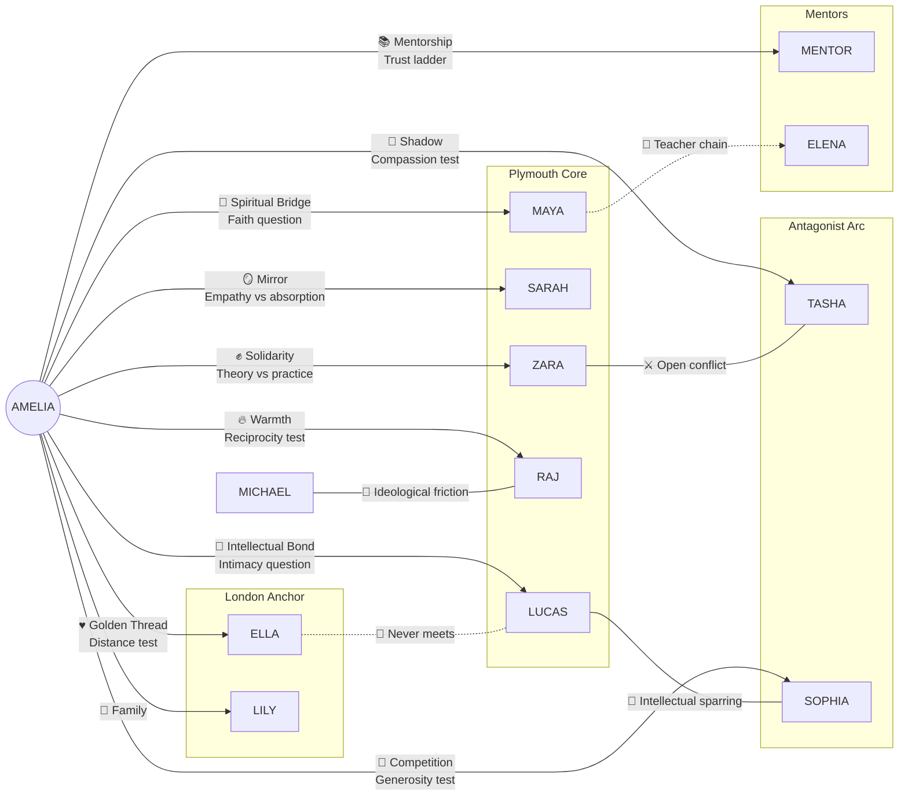

# The CK: Amelia V2 — Character Relationship Matrix

> How every relationship evolves across the 12-chapter arc. This document tracks the emotional trajectory of each bond, the pivotal moments that shift it, and the player's ability to strengthen or weaken it.

---

## HOW RELATIONSHIPS WORK

### Mechanics
- Each tracked relationship has a **numeric value (0–10)** representing closeness/trust
- Some start above 0 (existing relationships: Ella, Raj) or below 0 (antagonists: Tasha, Sophia)
- Relationship values are **hidden** — the player never sees a number, only narrative feedback
- Changes come from **choices** (active) and **omissions** (passive — ignoring someone costs you)

### Starting Values

| Character | Start | Reason |
|-----------|-------|--------|
| Ella | 6 | Lifelong best friend — high baseline |
| Lucas | 0 | Stranger at move-in |
| Zara | 0 | Stranger; met through classes |
| Raj | 1 | Instantly warm; starts with goodwill |
| Sarah | 0 | Stranger; quiet presence in the group |
| Maya | 0 | Stranger; met through flat social scene |
| Tasha | -2 | Antagonistic from first interaction |
| Sophia | -1 | Competitive tension from first lecture |
| Liz | 0 | Roommate; proximity but no history |
| Michael | 0 | Met through Zara/campus politics |
| Lily | 3 | Younger cousin who looks up to Amelia |
| Mentor | 0 | Assigned/discovered at end of Ch3 |

---

## CHAPTER-BY-CHAPTER RELATIONSHIP EVOLUTION

### Legend
- **↑** = relationship can increase this chapter (player choice)
- **↓** = relationship can decrease this chapter (player choice or neglect)
- **●** = character appears but no relationship change available
- **—** = character absent this chapter
- **★** = pivotal relationship moment (high-stakes shift)

### Overview Grid

| Character | Ch1 | Ch2 | Ch3 | Ch4 | Ch5 | Ch6 | Ch7 | Ch8 | Ch9 | Ch10 | Ch11 | Ch12 |
|-----------|-----|-----|-----|-----|-----|-----|-----|-----|-----|------|------|------|
| **Ella** | ↑ | ↑ | ↑ | — | — | ↑↓ | — | — | — | ★↑↓ | — | ● |
| **Lucas** | — | ↑ | ↑ | ↑ | — | ★↑↓ | — | — | — | — | — | ● |
| **Zara** | — | — | ↑↓ | — | — | ↑↓ | — | — | — | — | — | ● |
| **Raj** | — | ↑ | — | — | ★↑ | — | — | — | ↑ | — | — | ● |
| **Sarah** | — | ↑ | ★↑↓ | ↑ | — | ★↑↓ | ★↑↓ | ★★★ | — | — | — | ● |
| **Maya** | — | ↑(c) | ↑ | ↑ | — | ↑ | — | — | — | — | ↑ | — |
| **Tasha** | — | — | ↑↓ | — | — | ↑↓ | — | ★↑↓ | — | — | ★↑↓ | — |
| **Sophia** | — | — | — | — | ↑↓ | — | ★↑ | — | — | — | ↑ | — |
| **Liz** | — | ↑ | ↑↓ | — | — | — | — | — | — | — | — | ● |
| **Michael** | — | — | — | — | ↑ | — | — | — | — | — | — | — |
| **Lily** | — | ↑ | — | — | — | — | — | — | — | ★↑↓ | — | — |
| **Mentor** | — | — | — | ↑ | — | — | ↑ | ↑ | ↑ | — | ★↑ | — |

---

## DETAILED RELATIONSHIP ARCS

### AMELIA ↔ ELLA — "The Golden Thread"

**Core tension:** Can a childhood friendship survive when one person transforms and the other stays home?

| Chapter | Event | Potential Change | Emotional State |
|---------|-------|-----------------|-----------------|
| **1** | Ella calls to say goodbye; Amelia can be comforting or honest | +1 | Warm, anxious, unquestioned |
| **1** | Packing the photo of them together | +1 | Nostalgic |
| **2** | Amelia can call Ella after SU night instead of staying | +1 | Safety net; Ella as default |
| **3** | Amelia can call Ella during panic attack | +1 | Ella as crisis support |
| **6** | Christmas catch-up: honest, brief, or missed entirely | +1 / -1 | First real test — Ella senses the gap |
| **10** | ★ **The Reunion** — Ella and Amelia meet in London. Can be honest/guarded/performative | +2 / +1 / -1 | The friendship either deepens through honesty or frays through performance |
| **12** | Ella appears in epilogue (flavour only, no mechanic) | — | Resolution: the thread held, or it didn't |

**Journey:**
- **Early (Ch1–3):** Ella is the safety net. Amelia leans on her reflexively. The player earns points by maintaining the bond, but this can become a crutch — calling Ella means not building new connections in Plymouth.
- **Middle (Ch4–9):** Ella is mostly absent. The silence is the story. If the player hasn't invested, the distance grows naturally. If they have, the absence is felt but not fatal.
- **Late (Ch10):** The reunion is the real test. Amelia has changed. Ella hasn't (or has, differently). The player must choose: honest vulnerability (friendship deepens), warm performance (friendship coasts), or avoidance (friendship dies slowly).

**Max final value:** ~12 (started at 6, +6 available)
**Min final value:** ~3 (started at 6, -3 from neglect/choices)

**Impact on endings:** Ella relationship feeds into Sarah Score (×0.5 multiplier), contributes to Companion ending (avg relationships), and provides emotional anchor in Road Back chapter.

---

### AMELIA ↔ LUCAS — "The Thinking Bond"

**Core tension:** When intellectualism becomes intimacy, where's the boundary?

| Chapter | Event | Potential Change | Emotional State |
|---------|-------|-----------------|-----------------|
| **2** | Approach Lucas first in the kitchen | +1 | Curiosity — "what's he reading?" |
| **3** | Attend Jung reading group | +1 | Intellectual spark becomes ritual |
| **6** | ★ **3am kitchen conversation** — Lucas opens up about his father | +2 / +1 / -1 | Vulnerability offered; Amelia can honour it or deflect |
| **12** | Epilogue presence | — | Whatever it became |

**Journey:**
- **Early:** Lucas is the quiet one. The player chooses him by approaching him first — nobody else does. This first act of attention is what opens the door.
- **Middle (Ch3):** The Jung reading group creates a shared language. They start finishing each other's sentences about archetypes. It's intimate but safe — all ideas, no feelings.
- **Pivot (Ch6):** The 3am kitchen scene. Lucas drops the intellectual armour and talks about his absent father. If Amelia listens deeply and asks the hard questions, it's the most intimate scene in the game that isn't about Sarah. If she deflects or dismisses, Lucas never asks again.
- **Late:** Lucas is present in the background — a steady, thoughtful presence. His relationship value affects group dynamics and the Companion ending, but he doesn't have a crisis arc. He already did his work; his challenge is learning to let someone witness it.

**Max final value:** ~6 (started at 0, +6 available across limited interactions)
**Min final value:** -1 (only one possible decrease, Ch6)

**Design note:** Lucas's arc is intentionally quiet. Not every relationship needs a crisis. Some people just... become important to you, and you only realise how much when you count the hours you spent at the kitchen table together.

---

### AMELIA ↔ SARAH — "The Mirror in the Water"

**Core tension:** How much of yourself can you pour into someone else before you drown too?

| Chapter | Event | Potential Change | Emotional State |
|---------|-------|-----------------|-----------------|
| **2** | Approach Sarah first in the kitchen | +1 | Something pulls her; not yet nameable |
| **3** | ★ **The bench on the Hoe** — Sarah asks "Do you ever feel like you're watching your life from outside?" | +2 / +1 / -1 | The crack opens or closes; this choice echoes through the entire game |
| **4** | Text Sarah: "Haven't seen you in lectures" | +1 | Persistence |
| **6** | ★ **Go to Sarah's room, knock, don't leave** vs text vs report vs ignore | +2 / +1 / +1 / -1 | Amelia's investment tested — is she willing to be uncomfortable? |
| **7** | ★ **Sarah's darkness visible** — notice something alarming and act/deny | +2 / +1 / +1 / -2 | The escalation. Denial here is catastrophic for the Sarah Score. |
| **8** | ★★★ **THE CRISIS** — Sarah Score determines fate; player gets one final choice | +2 / +1 / — | The reckoning. Everything Amelia has done (or not done) converges here. |
| **8** | Aftermath — visit hospital / give space / pull away (if Sarah lives) | +1 / +1 / -1 | Recovery or retreat |

**Journey:**
- **First meeting (Ch2):** Sarah is the quietest person in the kitchen. Most players will go to Raj (he's warm) or Lucas (he's interesting). Going to Sarah is an act of instinct — "something pulls her." It's the first test of empathy.
- **The bench (Ch3):** The defining scene. Sarah asks a philosophical question that is really a cry for help. The three responses model the entire spectrum of engagement: honest vulnerability ("Yeah, I do sometimes"), clinical care ("That sounds hard, do you want to talk about it?"), or dismissal ("Everyone feels that way at uni"). Each is human. Each has consequences.
- **The descent (Ch6–7):** Sarah disappears by degrees. Missed classes, short texts, empty seat in lectures. The player must *choose* to notice and *choose* to act. The game does not prompt you. Amelia can go to Sarah's room (best), text (adequate), report to counselling (responsible), or assume she's busy (devastating).
- **The crisis (Ch8):** This is not a "boss fight." It's the accumulation of every small choice. The Sarah Score is calculated from relationship investment, stat investment (MH, SI, MC), and even the Ella relationship. The player's agency was in every moment leading up to this — not in the crisis itself.

**Max final value:** ~12 (started at 0, +12 available through dedicated attention)
**Min final value:** -5 (started at 0, multiple decrease opportunities)

**CRITICAL: Sarah Score formula** (detailed in [choice_map.md](choice_map.md)):
```
Sarah Score = ({Sarah} × 3) + MH + SI + MC + ({Ella} × 0.5)
```

| Sarah Relationship at Ch8 | × 3 | + Stats 15–20 avg | + Ella contrib | Likely Tier |
|---------------------------|------|-------------------|----------------|-------------|
| 10+ | 30+ | 45–50+ | 3–6 | Full save |
| 6–8 | 18–24 | 33–44 | 2–4 | Late save |
| 3–5 | 9–15 | 24–35 | 1–3 | Partial save |
| 0–2 | 0–6 | 15–26 | 0–2 | Borderline |
| Negative | 0 | 15–20 | 0+ | Tragic |

---

### AMELIA ↔ ZARA — "The Awakener"

**Core tension:** Solidarity cannot be abstract — it must cost something.

| Chapter | Event | Potential Change | Emotional State |
|---------|-------|-----------------|-----------------|
| **3** | Tasha's racism in seminar — public support, private support, or silence | +1 / +1 / — | The test: will Amelia put herself on the line? |
| **6** | Tasha's escalation — confront, report, support privately, or stay out | +1 / +1 / +1 / -1 | Escalation of the same test at higher stakes |

**Journey:**
- Zara doesn't need Amelia. Zara has survived worse. What Zara needs is to know Amelia *means it*. Public support in Ch3 is the entry ticket. Private-only support is accepted but noted — "Thanks. Would've been nice to hear that in front of everyone, though."
- If both Ch3 and Ch6 go well: Zara becomes a fierce ally, protective older-sister figure. She brings Amelia into Michael's orbit.
- If Amelia stays silent: Zara doesn't hate her, but she stops confiding. The relationship plateaus at polite.

**Max final value:** ~4 (started at 0, limited interactions)
**Min final value:** -1

---

### AMELIA ↔ RAJ — "The Hearth"

**Core tension:** Some people wear their kindness so naturally you forget to check if they're okay.

| Chapter | Event | Potential Change | Emotional State |
|---------|-------|-----------------|-----------------|
| **2** | Approach Raj first in the kitchen | +1 | Warmth, food, immediate comfort |
| **5** | ★ **Raj's family call** — push gently, respect privacy, or miss it | +2 / +1 / — | "It's fine." (It's not fine.) |
| **9** | Post-ordeal recovery — let Raj organise or step up yourself | +1 | Community rebuilding |

**Journey:**
- Raj is the easiest person to like and the easiest person to take for granted. He cooks, he organises, he holds the group together. The game tests whether Amelia reciprocates.
- **Ch5 is key:** Raj hangs up the phone tense and says "It's fine." Most players will respect his privacy. The best choice — "Raj, it doesn't sound fine" — is risky. He might push back. He doesn't. He talks about his family's expectations, the business, the weight of being the kind one. It's a small scene that reveals enormous depth.
- If the player misses this: Raj remains warm but surface. The friendship is real but never deep.

**Max final value:** ~6 (started at 1)
**Min final value:** 1 (hard to lose Raj — he doesn't hold grudges)

---

### AMELIA ↔ MAYA — "The Bridge"

**Core tension:** Faith offered freely — do you walk across the bridge, or just admire the architecture?

| Chapter | Event | Potential Change | Emotional State |
|---------|-------|-----------------|-----------------|
| **2** | Conditional (SI≥3 or Liz≥1): Maya reads tarot at flat party | +1 (auto) | First glimpse; Tower card foreshadowing |
| **3** | Maya's ceremony — participate, observe, or decline | +1 / +1 / — | The spiritual invitation |
| **4** | (If Maya mentor): First meeting, Cornwall trip | +1 | Mentor bond begins |
| **6** | Midwinter solstice (if OK≥4 and Elena or Maya≥3) | +1 | Seasonal; deepening |
| **11** | (If Maya mentor): Dawn meditation at stone circle | +1 | Culmination |

**Journey:**
- Maya is the spiritual gateway. She introduces the occult dimension casually — tarot at a party, meditation in a friend's room. Her path doesn't demand belief, just openness.
- If Amelia follows Maya's thread, it leads eventually to Elena. Maya is the bridge, not the destination. She knows this, and in a beautiful late scene, she acknowledges it: "I brought you to the door. Elena has the key."
- If Amelia doesn't engage with Maya, the entire occult path narrows. No Maya → no ceremony → no Elena Key 2 → no Alchemist ending.

**Max final value:** ~7 (started at 0)
**Min final value:** 0 (Maya doesn't lose respect for non-engagement; she just doesn't share what she would have)

---

### AMELIA ↔ TASHA — "The Shadow in the Mirror"

**Core tension:** Can you see the person inside the armour without getting cut by it?

| Chapter | Event | Potential Change | Emotional State |
|---------|-------|-----------------|-----------------|
| **3** | First attack — stand up, walk away, or laugh along | +1 / — / +1* | *Laughing along earns surface approval but costs MC/SI |
| **3** | Zara confrontation — supporting Zara costs Tasha points | -1 (from 3.3A) | If Amelia publicly opposes Tasha, Tasha resents it |
| **6** | Tasha's escalation — confront directly earns respect through strength | +1 (from 6.1A) | Paradox: standing up to Tasha is what earns her respect |
| **8** | ★ **Tasha's harmful act** — compassion, anger, report, or nothing | +2 / -1 / — / — | The pivotal moment: does Amelia see the hurt behind the harm? |
| **11** | ★ **Resolution** — compassion ending, anger ending, or avoidance | +2 / — / — | Conditional: only the compassion path transforms Tasha |

**Journey:**

**Three possible arcs:**

1. **The Compassion Path** ({Tasha} ≥ 3, MC ≥ 15 by Ch11):
   - Amelia consistently stands up to Tasha *without* cruelty
   - In Ch8, chooses "Why are you doing this?" instead of "This ends now"
   - In Ch11, Tasha breaks: "My mum hasn't called in three weeks."
   - The Shadow is integrated. Tasha doesn't become a saint — she becomes human.
   - **Final value: ~5** (from starting -2)

2. **The Anger Path** (MC ≥ 12, {Tasha} < 3):
   - Amelia fights Tasha with righteous anger
   - Effective: Tasha is stopped. But not healed.
   - In Ch11, Tasha transfers or drops out. Amelia won, but the victory is cold.
   - The Shadow is defeated, not integrated. Jungian failure.
   - **Final value: ~0** (from starting -2)

3. **The Avoidance Path** ({Tasha} < 0):
   - Amelia never confronts Tasha meaningfully
   - Tasha remains a toxic presence through the entire year
   - In Ch11, she's just... still there. Unresolved. A weight.
   - The Shadow projected outward and never faced.
   - **Final value: -2 to -3**

---

### AMELIA ↔ SOPHIA — "The White Queen"

**Core tension:** Competition and friendship are not opposites — but learning that is the work.

| Chapter | Event | Potential Change | Emotional State |
|---------|-------|-----------------|-----------------|
| **5** | Sophia project — compete, collaborate, or coast | +1 / +1 / -1 | First real interaction |
| **7** | ★ **Sophia's failure** — reach out, offer help, or enjoy it | +2 / +1 / — | The door opens if Amelia walks through it |
| **11** | Resolution — study friends or final rivalry | +1 / — | Conditional on accumulated investment |

**Journey:**
- Sophia starts as the enemy of Amelia's self-esteem. She answers every question first, gets the highest marks, makes Amelia feel small.
- But Sophia isn't cruel — she's lonely. Her competitiveness is her only language.
- **The pivot (Ch7):** Sophia fails a test. For the first time in her life. She doesn't know what to do. Amelia can reach out with genuine empathy (+2), offer academic help (+1), or privately enjoy the schadenfreude (0, but also 0 growth).
- If the player invests: by Ch11, Sophia and Amelia study together. It's awkward at first. Then it's not. Sophia says: "Do you want to get coffee? I don't actually have anyone to get coffee with." One of the game's best-earned moments.

**Max final value:** ~4 (from starting -1)
**Min final value:** -2

---

### AMELIA ↔ MENTOR — "The Guide"

**Core tension:** Everyone needs a teacher, but eventually you must teach yourself.

| Chapter | Event | Potential Change | Emotional State |
|---------|-------|-----------------|-----------------|
| **4** | First meeting — eager vs guarded | +1 / — | The student arrives |
| **4** | Cornwall trip — present vs academic vs resistant | +1 / — / — | Place as teacher |
| **4** | The mentor's test — path-specific ethical/spiritual challenge | +1 (most options) | Proving readiness |
| **7** | Mentor reveals vulnerability — reciprocate or deflect | +2 / +1 / — | The relationship becomes mutual |
| **8** | ★ Post-ordeal — let the mentor in | +1 / — | Amelia's crucible |
| **9** | Mentor acknowledges growth | +1 / — | Recognition earned |
| **11** | ★ **Final trip** — culmination scene | +1 | The relationship completed |

**Journey:**
- The mentor relationship is the most formally structured arc. Four chapters of deepening trust, tested by crisis, completed by mutual recognition.
- The key moment is Ch7: the mentor drops their professional mask and shares something personal. If Amelia reciprocates — shares her own fear, her own wound — the relationship transforms from teacher/student to something closer to equals. If she deflects, the mentor remains helpful but distant.
- **Each mentor has a different flavour of this scene:**
  - *Hawthorne:* admits he once chose integrity over career and almost lost everything
  - *Simmons:* reveals her own history with depression
  - *Maya:* confesses she sometimes uses spirituality to avoid her real feelings
  - *Elena:* tells Amelia about the pellar tradition dying — she might be the last

**Max final value:** ~8 (from 0)
**Min final value:** 0

---

## INTER-CHARACTER RELATIONSHIPS (Not player-controlled)

These relationships evolve based on narrative logic, providing texture and conflict. The player doesn't control them directly but can influence them through their own choices.

### Zara ↔ Tasha: Open War
| Phase | Dynamic |
|-------|---------|
| Early | Tasha targets Zara with microaggressions; Zara fires back |
| Mid | Escalation: Tasha does something with real consequences; Zara debates leaving |
| Late | Resolution depends on Amelia's moral choices — Tasha can be transformed, defeated, or persistent |
| *If Amelia supports Zara publicly (Ch3, Ch6):* | Zara stays, fights, draws strength from the solidarity |
| *If Amelia stays silent:* | Zara may still stay, but she's more isolated; the fight costs her more |

### Lucas ↔ Sophia: Competitive Respect
| Phase | Dynamic |
|-------|---------|
| Throughout | They argue in seminars, push each other intellectually, respect each other grudgingly |
| If Amelia befriends both | She becomes the bridge; they might actually become friends |
| Background | Never romantic — it's purely intellectual sparring |

### Michael ↔ Raj: Ideological Friction
| Phase | Dynamic |
|-------|---------|
| Early | Michael thinks Raj isn't political enough; Raj thinks Michael is exhausting |
| Mid | They find common ground through cooking (Michael at Raj's kitchen, planning a fundraiser meal) |
| Late | Mutual respect: different approaches to the same goal |
| Background colour | Raj: "Not everything has to be a protest, mate." Michael: "That's what people who benefit from the status quo always say." Raj: "I made you jollof rice." Michael: "...It's good jollof rice." |

### Maya ↔ Elena: Teacher Chain
| Phase | Dynamic |
|-------|---------|
| If both paths active | Maya recognises Elena's depth before Amelia does |
| Key scene | Maya says: "She knows things I've only read about. I think she's the real thing, Amelia." |
| Late | If Elena path unlocked, Maya steps back gracefully — she's the bridge, and she knows it |

### Ella ↔ the Plymouth friends: The Unseen Tension
| Phase | Dynamic |
|-------|---------|
| Throughout | Ella never meets the Plymouth group (except possibly via phone/video) |
| Subtext | Ella represents who Amelia *was*; Plymouth represents who she's *becoming* |
| If Amelia shares Plymouth stories | Ella is happy for her but feels left behind |
| If Amelia hides Plymouth | Ella senses the distance but not the reason |
| Design purpose | This absence is intentional — it mirrors the real experience of going to university |

---

## RELATIONSHIP IMPACT ON ENDINGS

| Ending | Key Relationships | Threshold |
|--------|-------------------|-----------|
| **The Scholar** | Mentor (Hawthorne) | High mentor value enriches the ending; not required |
| **The Companion** | All friends | Average relationship ≥ 6 across tracked characters |
| **The Healer** | Sarah, Mentor (Simmons) | Sarah outcome + mentor bond colour the ending |
| **The Alchemist** | Elena, Maya | Elena path requires direct investment |
| **The Whole** | Balanced across all | No single relationship neglected; none below 4 |
| **The Grief** | Sarah (failed), others (neglected) | Low MH + SI implies neglected bonds |
| **The Bittersweet** | Mixed | Some strong, some weak — real life |

### The "Average Relationship" Calculation (for Companion ending)

```python
tracked = [ella, lucas, zara, raj, sarah_if_alive, maya, mentor]
# Tasha and Sophia excluded (antagonists-turned-friends are bonus, not requirement)
avg_relationships = sum(tracked) / len(tracked)
# Companion requires avg ≥ 6
```

---

## MERMAID DIAGRAM — Relationship Web with Tension Types



---

## DESIGN PRINCIPLES FOR RELATIONSHIPS

### 1. No Relationship Is Free
Every bond requires active investment. Proximity alone (living in the same flat) doesn't build trust — choosing to show up does. Even Ella, starting at 6, decays naturally if the player doesn't maintain contact.

### 2. The Best Choices Cost Something
Supporting Zara publicly means making an enemy of Tasha. Staying up with Liz at 2am means being tired for the lecture. Going to Sarah's room means pushing past your own discomfort. The game rewards empathy, but empathy has a price.

### 3. Omission Is a Choice
Not reaching out to Sarah is a choice with consequences. Not meeting up with Ella at Christmas is a choice. The game tracks what the player *doesn't* do as much as what they do. In narrative feedback, this is expressed through absence: "Sarah wasn't at the lecture again today. You meant to text her, but..."

### 4. No Perfect Playthrough
The Point economy ensures the player cannot max every relationship. Choosing to deepen one bond means less time for another. This is *intentional* — it mirrors the real constraint of time, energy, and emotional bandwidth. The most honest ending might be The Bittersweet, where some relationships flourished and others faded. That's not failure. That's life.

### 5. Antagonists Are People
Tasha's compassion path is the most mechanically demanding arc in the game (requires high MC, specific choices in 4 chapters, and willingness to see humanity in someone who has been cruel). It's also the most thematically resonant: the Shadow cannot be destroyed, only integrated. Players who pursue it should feel like they earned something rare.
