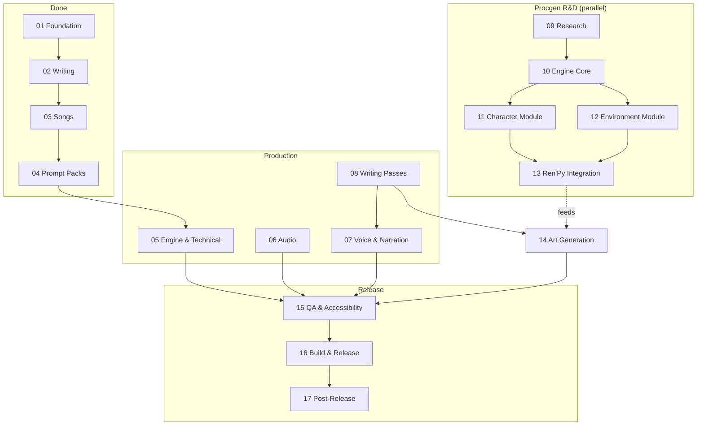

# The CK: Amelia V2 — TODO Overview

> Master index for the V2 task tracker. The old single `todo.md` has been split into focused,
> per-phase files grouped into stage folders. This file is the map — start here.
>
> **Two guiding principles:**
> 1. **All art is deliberately late** — the game must be fully runnable on placeholders first; sprites,
>    backgrounds, CG, and UI art are among the last things produced before release (Phase 14).
> 2. **Procedural generation is a modular R&D track** — built with a strict engine/content split so the
>    core could one day power a different game / a standalone engine (see `02_procedural_generation/`).

---

## Roadmap at a glance

**Ordering logic:** finish engine/audio/voice/writing (05–08) so text is locked and the game runs on
placeholders → let the procgen track (09–13) run in parallel and feed whatever it can into art →
produce/finalise all remaining art late (14) → QA, build, ship (15–17).

---

## Phase index

### `00_complete/` — Done (reference only)
| # | File | Summary |
|---|------|---------|
| 01 | [phase_01_foundation.md](00_complete/phase_01_foundation.md) | 14 design documents |
| 02 | [phase_02_writing.md](00_complete/phase_02_writing.md) | definitions.rpy + 12 chapters |
| 03 | [phase_03_song_integration.md](00_complete/phase_03_song_integration.md) | 26 slideshow labels, song placement |
| 04 | [phase_04_image_prompt_packs.md](00_complete/phase_04_image_prompt_packs.md) | 17 prompt files |

### `01_production/` — Active build-out
| # | File | Summary |
|---|------|---------|
| 05 | [phase_05_engine_technical.md](01_production/phase_05_engine_technical.md) | Placeholders, screens, save, hardening ← **current** |
| 06 | [phase_06_audio_production.md](01_production/phase_06_audio_production.md) | 20 songs + 51 ambient + 15 SFX |
| 07 | [phase_07_voice_narration.md](01_production/phase_07_voice_narration.md) | TTS narration (Ch1 done) + voice scope |
| 08 | [phase_08_writing_passes.md](01_production/phase_08_writing_passes.md) | Dialogue polish, balance, sensitivity |

### `02_procedural_generation/` — Modular engine R&D (parallel)
| # | File | Summary |
|---|------|---------|
| — | [README.md](02_procedural_generation/README.md) | **Read first** — engine/content split philosophy |
| 09 | [phase_09_research.md](02_procedural_generation/phase_09_research.md) | Survey techniques/repos/libs; pick approach |
| 10 | [phase_10_engine_core.md](02_procedural_generation/phase_10_engine_core.md) | Game-agnostic core (RNG, params, compositor) |
| 11 | [phase_11_character_module.md](02_procedural_generation/phase_11_character_module.md) | Character module + Amelia content pack |
| 12 | [phase_12_environment_module.md](02_procedural_generation/phase_12_environment_module.md) | Environment module + Amelia content pack |
| 13 | [phase_13_renpy_integration.md](02_procedural_generation/phase_13_renpy_integration.md) | Thin adapter into Ren'Py; feeds art |

### `03_art/` — Deliberately late
| # | File | Summary |
|---|------|---------|
| 14 | [phase_14_art_generation.md](03_art/phase_14_art_generation.md) | Sprites, 58 backgrounds, CG, UI art |

### `04_release/`
| # | File | Summary |
|---|------|---------|
| 15 | [phase_15_qa_polish.md](04_release/phase_15_qa_polish.md) | Playtest, balance, accessibility, localisation |
| 16 | [phase_16_build_release.md](04_release/phase_16_build_release.md) | Builds, packaging, store, ship |
| 17 | [phase_17_post_release.md](04_release/phase_17_post_release.md) | Support + procgen engine graduation |

---

## Status dashboard

| Category | Count | Status |
|----------|-------|--------|
| Design documents | 14 | ✅ Complete |
| Ren'Py scripts | 14 | ✅ Complete |
| Slideshow labels | 26 | ✅ Coded |
| Image prompt files | 17 | ✅ Complete |
| Engine / technical | — | 🟡 In progress (Phase 05) |
| Narrator voice | 1 / 12 chapters | 🟡 Ch1 generated (Phase 07) |
| Character voice refs | 18 | 🟡 Reference clips exist; scope TBD |
| Song audio (.ogg) | ~9 / 20 | 🟡 Partial (Phase 06) |
| Ambient tracks | 0 / 51 | ⬜ Phase 06 |
| SFX | 0 / 15 | ⬜ Phase 06 |
| Backgrounds | 0 / 58 final | 🟡 Placeholders active (Phase 14) |
| Character sprite sets | 0 / 18 final | 🟡 Layered stubs active (Phase 14) |
| CG illustrations | 0 / 19+ | ⬜ Phase 14 |
| Procgen engine | — | ⬜ R&D not started (Phase 09) |

---

## How to use this tracker
- **Work the lowest-numbered unfinished production phase first** (05 → 06 → 07 → 08), while the procgen
  track (09+) can proceed independently whenever there's appetite for it.
- **Keep art (14) last.** If a placeholder is blocking, fix the placeholder — don't start final art early.
- **Lock text before voicing/art** for a chapter to avoid re-recording and re-drawing.
- When a phase completes, mark its checkboxes and update the **Status dashboard** above.
- Record reproducible commands (voice pipeline, build, lint) and conventions in **repository memory**,
  not in prose here.

---

## Git history
| Commit | Phase | Description |
|--------|-------|-------------|
| `9caac90` | 01 | Foundation — design documents |
| `ce173ef` | 02 | Writing — definitions.rpy + 12 chapters (10,655 lines) |
| `9a0a0d3` | 03 | Songs — 20 placements |
| `c4758a3` | 04 | Image prompt packs (17 files) |
| `6898968` | 05 | Placeholder system + sourcing guide + images directory |
| `pending` | 05 | Engine work: screens.rpy, gui.rpy, layered_images.rpy, audio_guide |
| `pending` | — | Restructure: `todo.md` → `todo/` folder tree (this change) |

---

*Last updated: July 2026*
